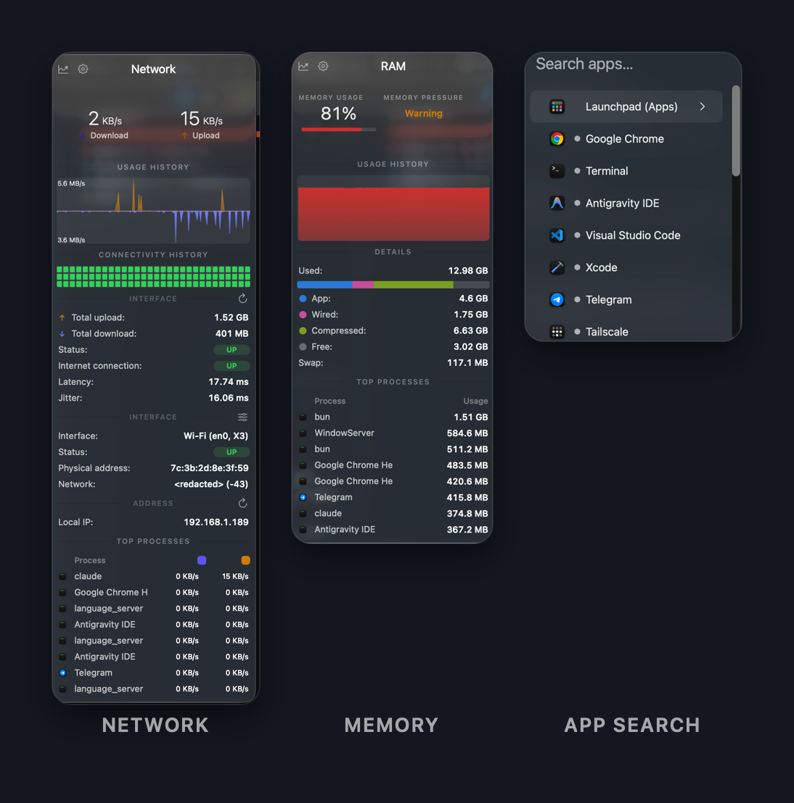
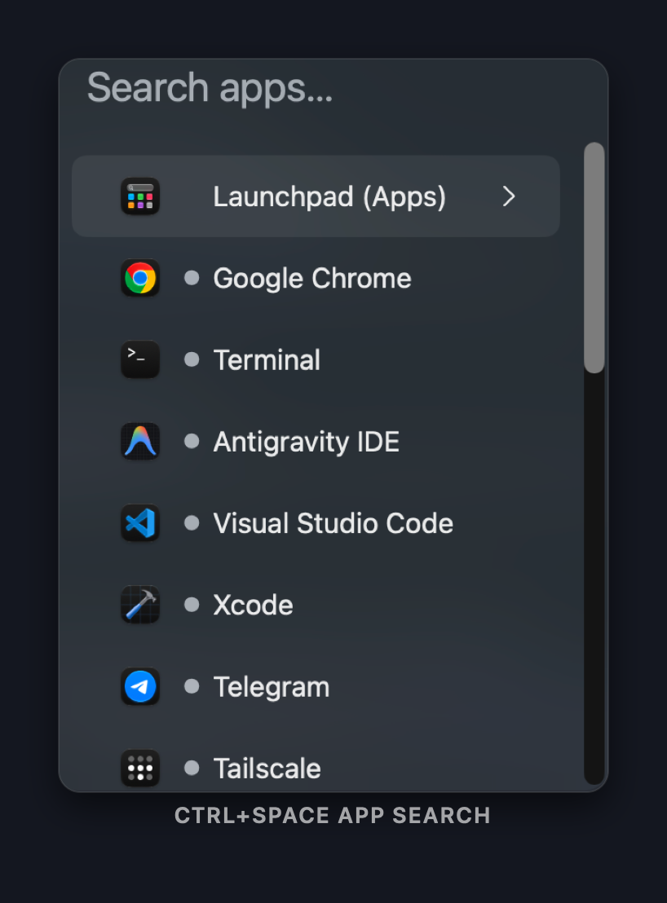

<p align="center">
  
</p>

<h1 align="center">Perch</h1>

<p align="center">
  A native macOS menu bar app launcher, window switcher, and system monitor — all in one.
</p>

<p align="center">
  
  
  
  
  
</p>

<p align="center">
  
</p>

<p align="center">
  
</p>

---

## What is Perch?

**Perch** is a lightweight, native macOS app that lives entirely in your menu bar. It combines two things:

- 🚀 **App Launcher & Window Switcher** — a curated list of your apps, accessible via a Spotlight-style search panel or a single hotkey. Perch shows each app's real icon, a running indicator, and does the right thing on click — launch, focus, minimise, or restore.
- 📊 **System Monitor** — live CPU, RAM, disk, network, and temperature readings drawn directly in the menu bar, with a mini graph popup on click (styled like Stats).

No Dock clutter. No separate apps. Just one **`Apps ▾`** item in the menu bar.

---

## Features

### App Launcher
| App state | Click does |
|---|---|
| Not running | Launch it |
| Running, window behind | Bring it to front |
| Running and frontmost | Minimise it |
| Minimised or hidden | Restore + focus |
| Full screen | Shows a notice (macOS limitation) |
| Menu-bar-only app | Activate it |

- **Spotlight-style search panel** — `⌃Space` opens a floating search panel at the pointer. Type to fuzzy-filter, press Return or click to switch.
- **MRU ordering** — recently used apps float to the top automatically.
- **Trackpad gesture** — configurable multi-finger tap opens the search panel (default: two-finger double tap).
- **Per-app hotkeys** — assign `⌃1` … `⌃9` shortcuts to jump to specific apps instantly.
- **`⌃Tab` custom switcher** — right-click any result → **Add to ⌃Tab Switcher**, and `⌃Tab` then cycles *only* those apps, most recently used first. Mark the three or four you actually live in and the key stops walking through everything. Marked nothing? It falls back to recent apps, so the key never does nothing. (Can be turned off if it conflicts with your browser or terminal.)
  - If another app already owns `⌃Tab`, macOS gives it to whoever registered first and tells the loser nothing. Perch notices, switches the cycle to **`⌥Tab`** and says so on launch.
- **`⌃\`` toggle** — minimises the frontmost app; press again to restore it.

<p align="center">
  
</p>

### System Monitor
Live readings drawn as compact widgets in the menu bar itself:

| Widget | What it shows |
|---|---|
| **CPU** | usage % |
| **RAM** | usage % |
| **Disk** | read/write speed |
| **Network** | ↑↓ throughput |
| **Temperature** | CPU die temp |

Click any widget in the menu to see a scrolling chart and detailed breakdown.

### Menu Bar Indicators
The menu bar status item shows running indicators next to each configured app:

```
●  Google Chrome      running, window on screen
○  Reminders          running, but minimised/hidden
   Firefox            not running
```

---

## Keyboard Shortcuts

| Shortcut | Action |
|---|---|
| `⌃Space` | Open / close the search panel |
| `⌃`` ` `` ` | Minimise frontmost app (press again to restore) |
| `⌃Tab` | Cycle to the previously used app |
| `⌃1` … `⌃9` | Jump directly to a pinned app (configured per-app) |

Every shortcut — including the search panel's own keys, the per-module popup
shortcuts and the Settings window — is listed in the
**[User Manual](docs/USER_MANUAL.md)**.

---

## Installation

### Download

One command. Paste it in Terminal:

```bash
curl -fsSL https://raw.githubusercontent.com/sagardn/Perch/main/Tools/install.sh | bash
```

It downloads the latest release, verifies the disk image, installs to
`/Applications` and launches it.

**Why a command and not a double-click?** Perch is signed ad hoc rather than
with a paid Apple Developer ID ($99/year), so macOS will not open it when it
arrives through a browser. Quarantine is attached by the program that downloads
a file, not by the file itself — `curl` does not attach it, so this path never
meets Gatekeeper.

<details>
<summary>If you downloaded the DMG with a browser and macOS blocked it</summary>

You will see **“Perch.app” Not Opened — Apple could not verify…**, offering only
*Move to Trash* and *Done*. Click **Done** — nothing is wrong with the app;
macOS is telling you it is not notarised.

On **macOS 15 and later**, the old right-click → Open trick no longer works.
Instead:

1. Drag Perch to **Applications** and try to open it once (you get the dialog above).
2. Open **System Settings → Privacy & Security**.
3. Scroll to **Security**. There is now a line saying *“Perch.app” was blocked…*
   with an **Open Anyway** button.
4. Click it, authenticate, then open Perch again and choose **Open**.

Or clear the flag on that one app from Terminal:

```bash
xattr -dr com.apple.quarantine /Applications/Perch.app
```

</details>

### Build from Source

Requires **Xcode** (or Xcode Command Line Tools for the launcher only).

```bash
# Clone the repo
git clone https://github.com/sagardn/Perch.git
cd Perch

# Build with Xcode
open Perch.xcodeproj
# Product → Archive → Distribute App → Copy App
```

Move `Perch.app` to your `/Applications` folder and launch it.

> **Note:** There is no Homebrew formula. `brew install stats` installs the upstream app, not this fork.

### Launcher only (no Xcode needed)

The `launcher/` subdirectory is a standalone Swift Package that needs only the Command Line Tools:

```bash
cd launcher
swift build -c release
cp .build/release/Perch /usr/local/bin/perch
```

### Uninstall

```bash
sh /Applications/Perch.app/Contents/Resources/Scripts/uninstall.sh
```

This quits Perch and removes:
- The SMC helper (`/Library/LaunchDaemons/com.sagar.perch.SMC.Helper.plist` and `/Library/PrivilegedHelperTools/com.sagar.perch.SMC.Helper`)
- `Perch.app`
- Application data (`~/Library/Application Support/Perch`, widget containers, and `com.sagar.perch` defaults)

If the app is already in the Trash, run it from the repo directly:
```bash
sh Kit/scripts/uninstall.sh
```

---

## Updates

Perch checks its own GitHub releases once per day and tells you when one is
newer. **Settings → Check for updates** changes the interval or turns it off.

*Silent* is offered but does exactly what it says: it downloads the release and
replaces the running app without asking. It is not the default for that reason.

### Releasing

Tag a version and CI does the rest:

```bash
# bump MARKETING_VERSION in Perch.xcodeproj first, then
git tag v1.0.1
git push origin v1.0.1
```

`.github/workflows/release.yaml` builds, packages `Perch.dmg` and publishes the
release with generated notes. The tag must match `MARKETING_VERSION` — the
workflow fails if it does not, because the updater compares the two and a
mismatched release could never be offered.

---

## Troubleshooting

### A hotkey does nothing

There is no "hotkey permission" in macOS, and nothing in System Settings grants
one — Perch registers its keys through Carbon, which needs no privilege at all.
When a key does nothing, it is almost always owned by something else: a global
hotkey belongs to whichever app registered it **first**, and the loser is told
nothing.

- **`⌃Tab`** — browsers, terminals and window managers all want this key. Perch
  now notices the collision, moves the app cycle to **`⌥Tab`**, and says so on
  launch.
- **Everything else** — if `⌃Space` or `` ⌃` `` are taken, Perch names them in a
  notice at launch. Quit whatever owns them, or turn Perch's off in Settings.
- **macOS itself** — check **System Settings → Keyboard → Keyboard Shortcuts…**
  for a system shortcut using the same combination.

### The hotkey fires, but the window does not move

That is **Accessibility**, which is a real permission and the only one Perch
needs to raise, minimise and restore windows:

**System Settings → Privacy & Security → Accessibility** → turn **Perch** on.

### It worked before an update, and stopped

macOS ties the Accessibility grant to the app's code signature. Perch is signed
ad hoc rather than with a paid Developer ID, so the signature changes with every
build — after an update the switch still *looks* on while the grant no longer
applies. Remove and re-add it:

1. **System Settings → Privacy & Security → Accessibility**
2. Select **Perch**, click **−**
3. Click **+**, choose `/Applications/Perch.app`, leave it switched **on**
4. Quit and reopen Perch

### The trackpad gesture does not open the search

That one needs **Input Monitoring**, because reading raw touches is a different
privilege from moving windows:

**System Settings → Privacy & Security → Input Monitoring** → turn **Perch** on.

### No CPU temperature in the menu bar

Three things to check, in order:

1. **Is the Sensors module on?** Open Perch's settings and look at the sidebar.
   A Mac where it was switched off stays off — that is a saved preference. New
   installs enable it, pick a CPU temperature sensor automatically, and prefer
   one that is actually reporting.
2. **Is your menu bar full?** If you see a `«` near the left of the status
   items, macOS is hiding the ones that do not fit, newest first — so Perch's
   temperature can be running and invisible. Quit a menu bar app, or ⌘-drag
   items to reorder, and it appears. This is macOS, not Perch.
3. **Does this Mac report one at all?** Open the Sensors popup: if it lists
   *Average CPU* and *Hottest CPU*, the readings exist and the problem is one of
   the two above.

The sensor Perch picks by default is **Average CPU**, which the app computes
from whichever keys your Mac actually reports — so it works the same on M1
through M5 and on Intel, rather than depending on a per-generation key.

---

## Requirements

- **macOS 14 Sonoma** or newer — the settings window uses `NavigationSplitView`, and the bundled widget extension requires 14
- Only stable macOS releases are supported (not betas)
- **Accessibility permission** is required for window switching (Perch will prompt on first launch)

---

## Configuration

Apps are stored in a JSON config file. The easiest way to add an app is:

1. Switch to the app you want to add
2. Click **`Apps ▾`** in the menu bar
3. Click **"Add [App Name]"** — it appears automatically when you have an unlisted app in front

To assign a `⌃N` hotkey or set a custom name, edit the config file directly:

```
~/Library/Application Support/Perch/apps.json
```

```json
[
  { "name": "Chrome",   "bundleID": "com.google.Chrome",         "shortcut": "1" },
  { "name": "Terminal", "bundleID": "com.apple.Terminal",        "shortcut": "2" },
  { "name": "Slack",    "bundleID": "com.tinyspeck.slackmacgap", "shortcut": "3" }
]
```

---

## Settings

Access settings from the **`Apps ▾`** menu → **Settings**.

| Setting | Default | Description |
|---|---|---|
| Search opens at pointer | On | Panel appears under the mouse cursor |
| Trackpad gesture | On (2-finger double-tap) | Gesture to open the search panel |
| Hide on outside click | On | Dismiss the panel when you click elsewhere |
| Ctrl+Tab cycle | On | Walk through recent apps with ⌃Tab |
| System monitor | On | Sample CPU/RAM/network on a timer |
| Menu bar widgets | CPU + RAM | Which readings appear in the status item |

---

## Privacy

No analytics, no telemetry, no crash reporting, no account. Perch makes exactly
two kinds of outbound request, both of which you can turn off:

- **`https://api.github.com/repos/sagardn/Perch/releases/latest`** — the update
  check, once per day. Set *Check for updates* to **Never** in Settings and it
  is never contacted. Nothing about your machine is sent; it is a plain read of
  the public releases endpoint.
- **`https://api.country.is/`** — your public IP and its two-letter country code
  (for the flag beside it), shown in the Network popup and only fetched while
  that popup is open. It returns those two fields and nothing else: no city, no
  coordinates, no ISP.

The Network module's connectivity check pings a host of your choosing
(`google.com` by default, configurable in that module's settings) when
connectivity history is enabled.

---

## FAQs

<details>
<summary><strong>How do I change the order of menu bar icons?</strong></summary>

macOS controls the order, not Perch. To rearrange: hold `⌘` and drag the icon to the position you want.

</details>

<details>
<summary><strong>Perch icons don't appear in the menu bar</strong></summary>

macOS 26 introduced a privacy control under **System Settings → Menu Bar**. Toggle **Perch** ON there.

</details>

<details>
<summary><strong>How do I reduce Perch's CPU or energy impact?</strong></summary>

Disable the system monitor modules you don't need. Sensors and Bluetooth are the most expensive. Disabling them can cut CPU usage by up to 50%.

</details>

<details>
<summary><strong>Desktop widgets not showing data</strong></summary>

Enable **macOS widgets** in Perch Settings. It's off by default to avoid overloading `chronod`.

</details>

<details>
<summary><strong>Sensors show incorrect CPU/GPU core count</strong></summary>

Sensor names are thermal zones, not individual cores. Apple changes SMC keys with each SoC. "CPU Efficient Core 1" means one sensor in the efficiency cluster, not a specific core.

</details>

---

## Project Structure

```
Perch/
├── Perch/                      # the app itself
│   ├── AppDelegate.swift       # module list, launcher start-up, updater
│   ├── Launcher/               # the app-switcher half
│   │   ├── SearchPanel.swift   # Ctrl+Space panel: search, arrow menu, right-click
│   │   ├── WindowControl.swift # Accessibility: raise, minimise, new window
│   │   ├── Recents.swift       # most-recently-used ordering
│   │   ├── Hotkey.swift        # Carbon hotkeys (Ctrl+Space, Ctrl+1-9, Ctrl+`)
│   │   ├── Gesture.swift       # trackpad taps via MultitouchSupport
│   │   └── AppEntry.swift      # apps.json, the configured list
│   ├── Views/                  # SettingsShell (SwiftUI), Dashboard, AppSettings
│   └── Supporting Files/       # Info.plist, entitlements, 45 translations
├── Kit/                        # shared framework
│   ├── constants.swift         # Branding: links, feed, updates - and the palette
│   ├── helpers.swift           # popup rows, markers, the intensity ramp
│   ├── module/                 # popup, window, widget and portal plumbing
│   └── Widgets/                # menu bar widget renderers, StatTile
├── Modules/<Name>/             # one folder per metric: CPU, GPU, RAM, Disk,
│                               # Net, Battery, Sensors, Bluetooth, Clock, Remote
│                               # each with reader, popup, portal, widget, settings
├── Widgets/                    # macOS desktop widget extension (needs macOS 14)
├── SMC/                        # privileged helper for SMC sensor access
├── launcher/                   # Command-Line-Tools-only build of the launcher
├── docs/USER_MANUAL.md         # the long-form manual
├── .github/workflows/          # build, release on a v* tag, linter, i18n
├── Makefile                    # local archive, notarise, sign, DMG
└── NOTICE.md                   # what this forked, and what was changed
```

A metric is drawn in **four** independent places — the menu bar widget, the
popup, the dashboard portal and the module's settings page. Changing a colour or
a marker in one leaves the other three alone; that is the single most common
surprise in this codebase.

---

## Contributing

Pull requests are welcome. Perch is MIT licensed — read it, learn from it, fork
it, and if you improve something, send it back.

**Good first contributions:** translations (every string lives in
`Perch/Supporting Files/*.lproj/Localizable.strings`), a new module or widget,
sensor keys for Macs I cannot test on, and bug fixes with a note on how to
reproduce what was broken.

**Before a large change,** open an issue first — not as a formality, but so you
do not spend a weekend on something that turns out to conflict with work already
in progress. Small fixes need no discussion; just send them.

**What helps a PR get merged:**

- One change per pull request. Two unrelated fixes are two PRs.
- Say what the change does and why in the description. The *why* is the part a
  reviewer cannot reconstruct from the diff.
- Keep the surrounding style. SwiftLint runs on every push (`.swiftlint.yml`);
  if a rule genuinely gets in the way, scope a `swiftlint:disable` and write
  down the reason rather than reformatting readable code.
- Build it first: `xcodebuild -project Perch.xcodeproj -scheme Perch build`.
  CI does the same on macOS 26, and the glass effects need that SDK.

Not sure where to start? Open an issue describing what you would like to change
and I will point you at the right file.

---

## License

[MIT License](LICENSE)

```
Copyright (c) 2019 Serhiy Mytrovtsiy (Stats, the work this is derived from)
Copyright (c) 2026 Sagar (Perch, modifications)
```

Perch is a fork of [Stats](https://github.com/exelban/stats). Upstream copyright notices are retained in source headers. Full attribution is in [NOTICE.md](NOTICE.md).
